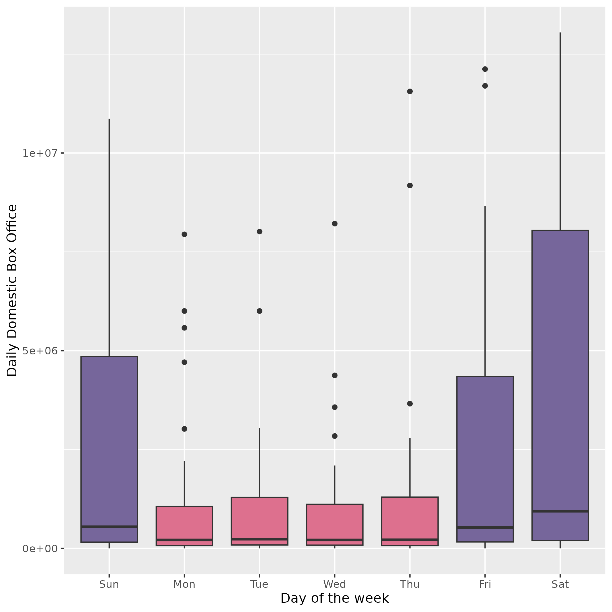
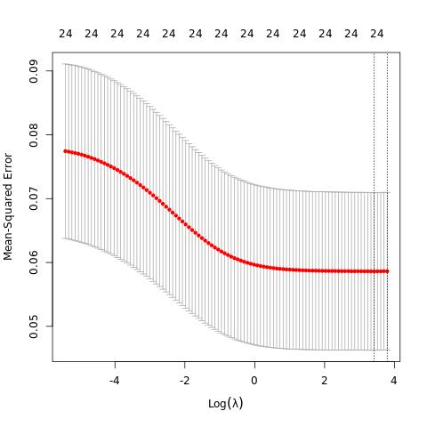
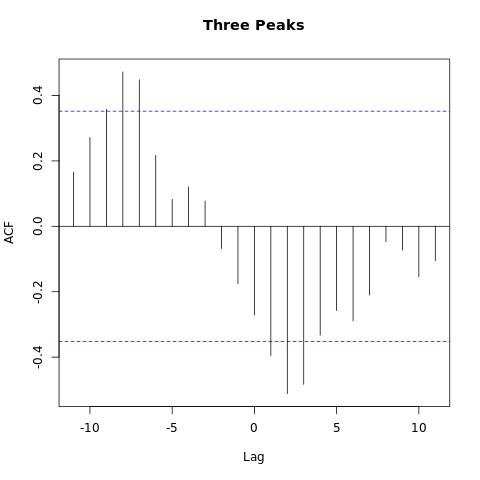
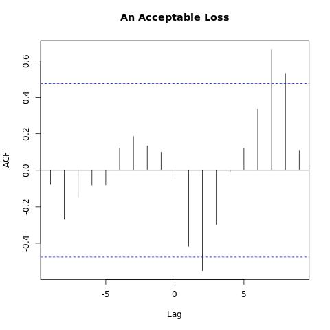
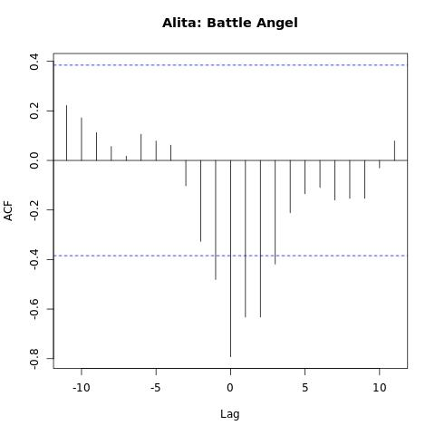
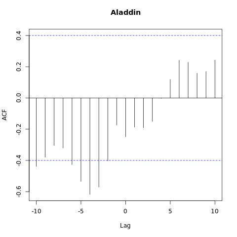

```{r setup, include=FALSE}
knitr::opts_chunk$set(warning = FALSE, message = FALSE, echo = FALSE) 
```

```{r check-packages}
packages <- c('tidyverse','kableExtra', 'GGally', 'patchwork', 'forecast','tsbox','tseries','vars','mgcv','lubridate','glmnet')
install.packages(setdiff(packages, rownames(installed.packages())))
```

```{r load packages, include=FALSE}
library(tidyverse)
library(kableExtra)
library(GGally)
library(patchwork)
library(forecast)
library(tsbox)
library(tseries)
library(vars)
library(mgcv)
library(lubridate)
library(glmnet)
select <- dplyr::select
```

```{r readdata, show_col_types = FALSE}
boxofficemojo_daily<- read_csv("../../instructor_data/olivia/data/boxofficemojo_daily_boxoffice.csv", show_col_types = FALSE)
boxofficemojo_releases<- read_csv("../../instructor_data/olivia/data/boxofficemojo_releases.csv", show_col_types = FALSE)
hsx_master<- read_csv("../../instructor_data/olivia/data/hsx_movie_master.csv", show_col_types = FALSE)
hsx_prices<-read_csv("../../instructor_data/olivia/data/hsx_movie_prices.csv", show_col_types = FALSE)
```

## 1. Introduction

With the advent of rapid digitization, the movie industry has encountered an explosive growth of greater than 1000 movies produced per year; consequently, it becomes a crucial concern to investors whether the movie succeeds [@7087152]. This zealous growth subsequently gives rise to virtual stock markets (VSMs), the world's largest of which, established in 1996 is the Hollywood Stock Exchange where unlimited number of consumers can trade thousands of entertainment securities [@VSM]. It comes to the fact that not only the success of the movie itself is at stake, but the inextricable relations of the movie's success with the VSM stock price could give rise to numerous hedging implications that would allow investors to make statistically informed decisions.

While extensive literature has constructed models predicting movie box office, the assessment of which in light of virtual market proves to be a fairly understudied domain recently. Older studies have found that despite arbitrage opportunities in VSMs, the predictive power of HSX is quite high [@VSM]. Within the movie box office models, a considerate amount of work relies on methods that lack interpretability, such as multi-layer back propogation neural network and ensemble learning [@ensemble]. Researchers [@7087152] point out that accuracy can be improved by incorporating social factors on various online platforms, in addition to classical intrinsic factors of the movie itself. Therefore, this study aims to gauge insights into significant predictors of this multi-layered relationship with recent data (\~2020) via statistical methods with greater interpretability such as ARIMA, Baysian Model Averaging and decision tree.

### Study Design

The aim of this multifaceted study is three-fold, which contains three inextricably intertwined complex objectives. First, we would like to analyze factors that predict movie box office. Secondly, we would like to analyze factors that predict virtual market stock prices. Finally, we would also like to assess whether virtual markets are efficient predictors of new product success, with manifestation in box office. On top of this hierarchy of research questions, the nature of this time series data set lends itself to diverse methods such as the ARIMA (autoregressive integrated moving average) model, exponential smoothing, etc. The two sets of predictor variables of interest are (1) movie budget, genre, distributor, release date, number of theaters, MPAA rating, (2) trading volume, total volume held long, total volume held short, and IPO date. The response variables are domestic, international and worldwide box office, and stock price of the 9380 movies.

## 2. Data & Data Processing

The data in this data set were scraped from two websites [@data]: (1) Hollywood Stock Exchange (HSX.com), the world's leading virtual entertainment market which provides information on movie stock prices, (2) BoxOfficeMojo.com which tracks box-office revenue in a systematic way and provides the information on movie box office. The former HSX data source contains 325,640 daily domestic box office results (1995-2020) which includes the number of theaters exhibiting the movie release on this date and identifier of movie release; it also contains 16,968 movie releases, its identifier, budget, distributor name, domestic gross to date, international gross to date, worldwide gross to date, release date, widest release, genre and MPAA rating. The latter BoxOfficeMojo data source contains master movie data on 9,380 movies from HSX.com., i.e. genre, stock IPO date, release date, delist date, MPAA rating, number of theaters and distributor; it also contains 12,677,219 hourly movie stock prices (1997-2020) from HSX.com, along with total number of shares held short, shares held long and trading volume at the time stamp.

```{r, echo=FALSE, cache=TRUE}
### FUNCTION TO convert running time into minutes:
char_to_minutes <- function(time_string){ 
    time_components <- strsplit(time_string, " ")[[1]]
    hours <- as.integer(time_components[1])
    minutes <- as.integer(gsub("min", "", time_components[3])) # remove "min" from the string
    if (length(time_components) == 4) {
      total_minutes <- hours * 60 + minutes
    } else {
      total_minutes <- as.integer(time_components[1])
    }
    total_minutes
}

boxofficemojo_releases<-boxofficemojo_releases%>%select(-old_bomojo_id,-hsx_symbol,-imdb_title_bomojo_url,-domestic_opening)%>%
  rowwise()%>%
  mutate(widest_release_num=extract_numeric(widest_release))%>%
  select(-widest_release)%>%
  mutate(runtime_minutes=char_to_minutes(running_time))%>%
  select(-running_time)

# filter out distributor names with fewer than 10 movie releases
# count the number of data points for each distributor
distributor_counts <- boxofficemojo_releases %>% count(distributor_name)
# filter out the distributors with fewer than 10 data points
valid_distributors <- distributor_counts %>% filter(n >= 10) %>% pull(distributor_name)
# filter the original dataframe based on the valid distributors
boxofficemojo_releases <- boxofficemojo_releases %>% filter(distributor_name %in% valid_distributors)

boxofficemojo_releases_by_genre<-boxofficemojo_releases%>%
  separate_rows(genres, sep = ",\\s*")%>%
  mutate(Genre=gsub("[^[:alpha:]]", "", genres))%>%
  select(-genres)%>%
  filter(budget!=0)%>%
  filter(Genre!="News")

hsx_master<-hsx_master%>%select(-phase,-release_pattern)
```

In data processing, we first filtered out extraneous information irrelevant to our analysis, such as the old BoxOfficeMojo id, the BoxOfficeMojo symbol, synopsis of the movie and the BoxOfficeMojo url. To facilitate further analysis, we transformed the dates from characters to the correct format. Because many movies are attributed multiple genres, in order to analyze the impact of genre on the response, we separated the list of genres into separate rows so that each contains one category Then we filtered out missing information such as phase (with over 96% missing) and release pattern (98% missing) in HSX data, as well as domestic opening (every row contains the identical 0) in BoxOfficeMojo data. In order to investigate the relationship between distributor name and movie box office, we filtered out distributors with fewer than 10 movie releases and obtained 15,112 data records for 3,004 movie releases from 107 unique distributors. Likewise, we filtered out the News genre since it has only 1 observations, and obtained 3,003 movie releases from 21 genres.

## 3. Exploratory Data Analysis

### Objective 1: Predicting Movie Box Office

```{r fig.show='hold', fig.ncol = 2, fig.align = "center", out.width = c("52%","38%"), warning = FALSE, fig.cap = "(a) Relationship between Budget and Box Office by Region across Genres, (b) Box Office by Day of the Week", cache = TRUE}

## {r, echo=F, warning=F, out.height  = '50%', out.width = '70%', cache=TRUE}

df1<-boxofficemojo_releases_by_genre%>%
  group_by(identifier)%>%
  summarise(domestic=sum(domestic_gross), international = sum(international_gross), worldwide = sum(worldwide_gross))

df1<-df1%>%left_join(boxofficemojo_releases_by_genre, by=c('identifier'='identifier'))%>%
  select(domestic,international,worldwide, budget, Genre)%>%
  na.omit()%>%
  filter(Genre=='Action'|Genre=='Adventure'|Genre=='Animation'|Genre=='Comedy'|Genre=='Thriller'|Genre=='Drama'|Genre=='Fantasy'|Genre=='Horror'|Genre=='Musical'|Genre=='Documentary'|Genre=='Romance'|Genre=='SciFi')

df1<-df1%>%pivot_longer(-c(budget, Genre), names_to = "Region", values_to = "Sales")

# Plot the sales data
ggplot(df1, aes(x = log(budget), y = Sales, color = Region)) +
  geom_point(size=0.5, fill=NA) +
  geom_smooth(fill=NA) +
  theme(legend.key.size = unit(0.3, "cm")) +
  facet_wrap(~ Genre)+
  # ggtitle("Relationship between Budge and Box Office by Region across Genres") +
  xlab("Log(Budget)") +
  ylab("Box Office")+
  scale_color_discrete(name = "Region", guide = guide_legend(override.aes = list(size = 1)))+
  theme(panel.spacing.x = unit(2, "mm"))
#ggsave("budget_EDA.png")

# # boxplot showing the box office are higher on weekends
# ggplot(titanic, aes(x=as.factor(wday(bo_date)), y = daily_domestic_gross))+geom_boxplot()
# titanic$day<-wday(titanic$bo_date, label=TRUE) #lubridate
# titanic<-titanic%>%mutate(type = ifelse(day %in% c("Sun","Fri","Sat"), "Highlighted", "Normal"))

# ggplot(titanic, aes(x=day, fill=type, y = daily_domestic_gross))+geom_boxplot()+ scale_fill_manual(values=c("#76669B", "#DD708E"))+theme(legend.position = "none")+labs(x="Day of the week", y="Daily Domestic Box Office")
# ggsave("days_of_the_week.png")


```

We observe that the relationship between budget and box office (Figure 1(a)) is vastly different across genres: Action, adventure, drama and sci-fi movies have a steep slope and generally high budget spans, with outliers which have exceedingly high budget and high box office. On the other hand, genres such as horror, thriller and romance have a much flatter slope, which corresponds to the industry knowledge that certain genres are more conducive to low-budget film making than others. According to New Review of Film and Television Studies (2011), horror and thriller movies are typically associated with such framework, and our further analysis corroborates this insight. By calculating the box office to budget ratio (Table 1), we found that three out of the top 4 movie in terms of this cost effectiveness are horror or thriller movies.

We also observe in Figure 1(b), the daily domestic movie box office for the movie Titanic as an example, that the day in the week has a significant effect on the box office, with the weekend (Friday, Saturday and Monday) associating with noticeably higher box office.

```{r}
genres <- c("Horror, Mystery, Thriller", "Horror, Mystery", "Biography, Dcoumentary", "Horror, Mystery, Thriller")

boxofficemojo_releases_by_genre%>%mutate(ratio=worldwide_gross/budget)%>%
  arrange(desc(ratio))%>%
  select(title, ratio)%>%
  unique()%>%
  head(4)%>%
  cbind(genres)%>%
  kable(caption = "Top Movies by Box Office to Budget Ratio")
```

### Objective 2. Predicting Stock Price

The second objective is again two fold. We first want to predict (1) the price, and (2) the volatility of the stock in order to both gauge insights into its average performance, and assess the risk in the investment. We measure the stock price as the average over time. To measure volatility, we use the standard deviation of its prices over time to quantify the rate of fluctuations, as suggested by the Corporate Finance Institute [@volatility].

```{r, echo=F, warning=F, fig.height  = 4, fig.width = 8, cache=TRUE}
# CALCULATE AVG PRICE and VOLATILITY
# Group the data frame by stock and calculate the average price
average_prices <- aggregate(price ~ identifier, data = hsx_prices, mean)

# Calculate the volatility of each stock
volatility <- function(x) { sd(x) / mean(x) }
volatilities <- tapply(hsx_prices$price, hsx_prices$identifier, volatility)

# Combine the average prices and volatilities into a single data frame
result <- data.frame(identifier = average_prices$identifier,
                     average_price = average_prices$price,
                     volatility = as.numeric(volatilities))

df4<-result%>%inner_join(hsx_master, by=c('identifier'='identifier'))%>%
  inner_join(boxofficemojo_releases_by_genre, by=c('title'='title'))%>%
  select(Genre, runtime_minutes, mpaa_rating.y, theaters, distributor_name, average_price, volatility, identifier.x)

p1<-ggplot(df4, aes(x=distributor_name, y=volatility)) + geom_boxplot() + coord_flip()+labs(x="Distributor", y="Volatility")+ggtitle("Volatility vs. distributors")

p2<-ggplot(df4, aes(x=Genre, y=average_price))+ geom_boxplot() + coord_flip()+labs(y="Average Stock Price")+ggtitle("Average price vs. genres")

p1+p2
```

We observe distributor's significant impact on volatility: As we might have expected, the stock of the "big name" production companies such as Walt Disney, Sony Pictures, Fox and Warner Brothers tend to have low volatility and tight range; Whereas, New Line Cinema has exceedingly variable volatility spanning from under 0.1 to around 0.8. Similarly we observe genre's impact on stock price: Musical and Animation tend to have the highest stock prices albeit a wide range, whereas history, sport and horror movies have consistently low average stock prices.

```{r, echo=F, warning=F, out.height  = '50%', out.width = '50%', cache=TRUE}
p_volatility<-ggplot(result, aes(x = average_price, y = volatility))+
  geom_point(size = 0.5, color = "darkviolet")+geom_smooth(fill=NA)+labs(x = "Average Price", 
       y = "Volatility",
       title = "Volatility vs. Price for HSX Stocks")

df2<-hsx_prices%>%
  filter(identifier=="1031")%>%
  select(price, shares_long, shares_short, trading_vol)


# panel.points<-function(x,y)
# {
#   points(x,y,cex=0.5)
# }
# 
# pairs(df2,lower.panel=panel.points)
```

### Objective 3. Relating virtual markets to product success

```{r, echo=F, warning=F, out.height  = '50%', out.width = '50%', cache=TRUE}
# Aladdin, Avengers
movie_name<-"Avengers: Endgame"
df_avengers<-boxofficemojo_releases%>%filter(title==movie_name)%>%
  inner_join(boxofficemojo_daily, by=c('identifier'='identifier'))%>%
  select(daily_domestic_gross, bo_date)

stocks_avengers<-hsx_master%>%filter(title==movie_name)%>%
  inner_join(hsx_prices, by=c('identifier'='identifier'))

stocks_avengers$retrieved_at <- as.Date(stocks_avengers$retrieved_at)

p3<-ggplot(data = df_avengers) +
  geom_line(aes(x = bo_date, y = daily_domestic_gross), 
            color = "#F8766D",
            alpha = 0.6,
            size = 0.6) +
  labs(x = "Date", 
       y = "Box Office",
       title = "Avengers: Endgame box office") +
  scale_x_date(date_labels = "%b-%y")+
  theme_minimal()

p4<-ggplot(data = stocks_avengers) +
  geom_line(aes(x = as.Date(retrieved_at), y = price), 
            color = "#09557f",
            alpha = 0.6,
            size = 0.6) +
  labs(x = "Date", 
       y = "USD per share",
       title = "Avengers: Endgame stock price") +
  scale_x_date(date_labels = "%b-%y")+
  theme_minimal()


# Aladdin, Avengers
movie_name<-"Aladdin"
df_avengers<-boxofficemojo_releases%>%filter(title==movie_name)%>%
  inner_join(boxofficemojo_daily, by=c('identifier'='identifier'))%>%
  select(daily_domestic_gross, bo_date)

stocks_avengers<-hsx_master%>%filter(title==movie_name)%>%
  inner_join(hsx_prices, by=c('identifier'='identifier'))

stocks_avengers$retrieved_at <- as.Date(stocks_avengers$retrieved_at)

p5<-ggplot(data = df_avengers) +
  geom_line(aes(x = bo_date, y = daily_domestic_gross), 
            color = "#F8766D",
            alpha = 0.6,
            size = 0.6) +
  labs(x = "Date", 
       y = "Box Office",
       title = "Aladdin box office") +
  scale_x_date(date_labels = "%b-%y")+
  theme_minimal()

p6<-ggplot(data = stocks_avengers) +
  geom_line(aes(x = as.Date(retrieved_at), y = price), 
            color = "#09557f",
            alpha = 0.6,
            
            size = 0.6) +
  labs(x = "Date", 
       y = "USD per share",
       title = "Aladdin stock price") +
  scale_x_date(date_labels = "%b-%y")+
  theme_minimal()

p_volatility
(p3+p5)/(p4+p6)
```

We observe an inverse association between average price and volatility. Comparing the time series movement of box office and stock price for movies Avenger and Aladdin, we notice that for both movies, significant movements in stock price (albeit different directions, Avenger rose in stock price while Aladdin declined) preceded significant declines in box office, hinting the predictive power of VSM on box office.

## 4. Aims & Hypotheses

**Aim 1** What are the factors that affect the fluctuations of movie box office over time? Specifically, does the daily theater count or widest release correlate more strongly with the oscillations in movie box office - in other words, does a movie achieve success through continuous rapport or does a transient success suffice? How are budget, genre, runtime and distributor associated with a movie's box office? Do daily theater count correlate with, or wildest release?

**Aim 2** What are the factors that affect HSX stock average price, and volatility over the span of time?

**Aim 3** To what extent does the HSX stock prices predict the movie box office?

**Primary Hypothesis** The daily theater count correlates more strongly with daily movie box office than the widest release. While genre, and distributor have a significant effect on the box office, the budget and runtime do not have significant effect.

**Secondary Hypothesis** The HSX stock average price correlates negatively with the volatility over the span of time, and HSX stock prices move synchronously with fluctuations in box office.

## 5. Baseline Univariate Model: ARIMA

To establish a baseline model for movie box office over time independent of the covariates, we first examine a Auto-Regressive Integrated Moving Average (ARIMA) model, also known as Box-Jenkins approach [@KOTU2019395]. As a combination of two models, the auto-regressive and the moving average models, the ARIMA model helps us predict the future forecast via lagged observations and an integrated moving average. We take the time series box office of the movie Deep Sea as an example, and visualize the time series data:

```{r fig.cap = "Time Series Visualization for Deep Sea Box Office", out.width= "40%", fig.width = "40%", cache=TRUE, fig.align='center'}
arima_predictors<-boxofficemojo_daily%>%left_join(boxofficemojo_releases, by=c('identifier'='identifier'))%>%
  select(bo_date, budget, daily_domestic_gross, daily_theater_count, distributor_name, widest_release_num, mpaa_rating, title,runtime_minutes)

arima_predictors$distributor_name <- as.factor(arima_predictors$distributor_name)
arima_predictors$mpaa_rating <- as.factor(arima_predictors$mpaa_rating)

# showing monthly return for single stock
# arima_predictors%>%group_by(title)%>%count()%>%arrange(desc(n))
deep_sea_bo<-arima_predictors%>%filter(title=="Deep Sea")

ggplot(deep_sea_bo, aes(bo_date, daily_domestic_gross)) + geom_line(color = "blue", size=0.1)+
  labs(x="Date", title="Daily Domestic Gross Box Office", y="Daily Domestic Gross Box Office")
```

In order to perform any successive modeling, by model assumption, requires data to be stationary. That is, the mean, variance, and covariance of the series should be constant with respect to time, and there should not be white noise. Therefore, we take the difference between the log value of the daily domestic gross box office to stationarize the data, and demonstrate later through the Dickey Fuller Test that the data meets model assumptions (in the section below). By the same token, we can stationarize the HSX stock price data before fitting ARIMA to forecast future prices and perform the model assessment, diagnostics and sensitivity analysis in the following sections.

### 5.5. ARIMA: Model Assumptions, Sensitivity Analysis & Validation

#### 5.5.1 Model Assumptions

#### 5.5.1.1 Stationary: Dickey-Fuller test

We conduct the Dickey-Fuller test to assess the stationary principle: The Dickey-Fuller test returns a p-value of 0.01, resulting in the rejection of the null hypothesis and accepting the alternate, that the data is stationary.

```{r eval=FALSE}
adf.test(diff(log(deep_sea_bo$daily_domestic_gross)), alternative="stationary", k=0)
```

By by stationary it means that the properties of the series doesn't depend on the time when it is captured. A white noise series and series with cyclic behavior can also be considered as stationary series.

#### 5.5.1.2 Univariate

We assess box office as the univariate response variable, which aligns with ARIMA's assumptions that data should be univariate, since ARIMA works on a single variable.

#### 5.5.2 Sensitivity Analysis: ACF/PACF

There are primarily two hyperparameters in the model that we can tune to perform sensitivity analysis, MA (moving-average) and AR (auto-gression) coefficients. The ACF (Auto-Correlation Function) gives us values of any auto-correlation with its lagged values which will help us determine the number of MA coefficients in our ARIMA model, while the PACF (Partial Auto-Correlation Function) finds correlation of the residuals with the next lag value which helps us identify the number of AR coefficients in our ARIMA model. In the ACF graph below, the curve drops significantly after the first lag, which indicates a moving average component of MA(1). We can tune the MA and AR coefficients to achieve sensitivity analysis.

The standard ARIMA models expect as input parameters 3 arguments, p which standards for the number of lag observations, d which is the degree of differencing, as well as q which is the size of the moving average window. This study will tune the parameters via cross validation with a 70%-30% split, as well as sensitivity analysis.

```{r fig.cap = "ACF and PACF for the Deep Sea Box Office Model", out.width= "70%", fig.width = "70%", cache=TRUE, fig.align='center'}
tsdisplay(diff(log(deep_sea_bo$daily_domestic_gross)))
```

Additionally, the study also aims to perform sensitivity analysis based on seasonality, which compares the robustness of the model over the seasonal span.

#### 5.5.3 Preliminary Results & Validation

As preliminary results, we obtained a with p (AR coefficient) of 5, d (Integrated value) of 0, and q (MA) value of 2 which obtains an AIC value of 759.91, and BIC value of 800.03. The graph above demonstrates that the model is a close fit to the training data. Splitting past data into a training set (pseudo future data), we can examine performance on this pseudo future data to achieve cross validation.

#### 5.5.4 Model Diagnostics

```{r fig.show='hold', fig.ncol = 2, fig.align = "center", out.width = "40%", warning = FALSE, fig.cap = "(a) Training Fit for ARIMA Model, (b) Diagnostic Plot for ARIMA Model", cache = TRUE}
# plot(diff(log(deep_sea_bo$daily_domestic_gross)),type='l', main='log returns plot')

# acf(diff(log(deep_sea_bo$daily_domestic_gross)))
# pacf(diff(log(deep_sea_bo$daily_domestic_gross)))

# FIT MODEL:
fit <- arima(diff(log(deep_sea_bo$daily_domestic_gross)), c(5,0,2))

# fitARIMA <- auto.arima(diff(log(deep_sea_bo$daily_domestic_gross)), trace=TRUE)

plot(as.ts(diff(log(deep_sea_bo$daily_domestic_gross))) )
lines(fitted(fit), col="red")

# plot(diff(log(deep_sea_bo$daily_domestic_gross)),type='l', main='log returns plot')

# acf(diff(log(deep_sea_bo$daily_domestic_gross)))
# pacf(diff(log(deep_sea_bo$daily_domestic_gross)))
# 
# (fit <- arima(diff(log(deep_sea_bo$daily_domestic_gross)), c(3, 0, 1)))
# 
# fitARIMA <- auto.arima(diff(log(deep_sea_bo$daily_domestic_gross)), trace=TRUE)
# 
# plot(as.ts(diff(log(deep_sea_bo$daily_domestic_gross))) )
# lines(fitted(fitARIMA), col="red")
# 
# ## FUTURE
# futurVal <- forecast(fitARIMA,h=5, level=c(99)) #confidence level 99%
# plot(forecast(futurVal))
# # 5 predicted values
# futurVal$mean
# 
# checkresiduals(fitARIMA)

autoplot(fit)
```

Plotting the characteristic roots for the model fitted, we see that they are all inside the unit circle, as we would expect because R ensures the fitted model is both stationary and invertible.

## 6. Multivariate Model: Vector Autoregression (VAR)

While the baseline ARIMA model gauges insights into the changes into the fluctuations of the box office over the span of time in and of itself, since we are essentially interested in the the factors that predict the box office or stock price, we resort to the VAR (Vector Autoregression) model which is essentially a generalization of the univariate autoregressive ARIMA model. A VAR model is a type of multivariate time series model that can capture the dynamic interactions between multiple time series variables via the assumption that each variable is a function of its own past values as well as the past values of other variables in the system [@VAR]. For movie box office, we are primarily interested in genre, distributor, MPAA rating, budget, daily theater count, widest release and runtime which we plan to include in the model. For the former three categorical variables, we plan to use one-hot encoding to convert them to factor levels. Taking the box office data of the movie Titanic as an example, we explore the time series visualization of the quantitative variables below:

```{r fig.cap = "Time Series Plots of Quantitative Variables for Titanic", out.width= "50%", fig.width = "50%", cache=TRUE, fig.align='center'}
titanic<-arima_predictors%>%filter(title=="Titanic")
titanic<-titanic%>%arrange(bo_date)

daily_domestic_gross <- ts(titanic$daily_domestic_gross, start = c(1995,1,1), frequency = 365) 
daily_theater_count <- ts(titanic$daily_theater_count, start = c(1995,1,1), frequency = 365)
widest_release_num <- ts(titanic$widest_release_num, start = c(1995,1,1), frequency = 365)
runtime_minutes <- ts(titanic$runtime_minutes, start = c(1995,1,1), frequency = 365)

p1<-ts_ggplot(daily_domestic_gross)+labs(y="Value",x="Daily Domestic Gross")
p2<-ts_ggplot(daily_theater_count)+labs(y="Value",x="Daily Theater Count")
p3<-ts_ggplot(widest_release_num)+labs(y="Value",x="Widest Release")
p4<-ts_ggplot(runtime_minutes)+labs(y="Value",x="Runtime (min)")

(p1+p2)/(p3+p4)
```

By the same token, for HSX stock prices, we are primarily interested in genre, distributor, number of shares short, number of shares long, total trading volume which we plan to include in the model. For the former categorical variables, we plan to use one-hot encoding to convert them to factor levels.

### 6.5 VAR: Model Assumptions, Sensitivity Analysis & Validation

#### 6.5.1 Model Assumptions

##### 6.5.1.1 Stationary Principle

In the same token as ARIMA, since VAR is essentially a generalization of ARIMA in the multivariate case, we would also like to assess whether the variables under study are stationary. We use the Philips Perron test to assess the stationary principle, which finds that the response variable (daily domestic gross box office) along with all the predictor variables of interest above (daily theater count, wildest release, and runtime in minutes) having p values of 0.01, 0.05, 0.018 and 0.01 respectively. Therefore, we reject the null hypothesis which suggests that the data is stationary.

```{r eval = FALSE}
pp.test(daily_domestic_gross)
pp.test(daily_theater_count)
pp.test(widest_release_num)
pp.test(runtime_minutes)
```

#### 6.5.2 Preliminary Results & Validation

We fit a preliminary model using the daily theater count, widest release and daily domestic gross box office which obtained an adjusted $R^2$ value of 0.93. After this, we will select the optimal lag order behind the VAR we will be using, which is 8 from the model output. Lastly, we will run diagnostics tests for autocorrelation, heteroscedasticity, normality and stability. By the same token, we plan to fit the VAR model for stock price using the number of shares long, the number of shares short and the trading volumne as predictors. Splitting past data into training set to create a pseudo future dataset from the dataset given, we plan to examine performance on future data via cross validation.

```{r eval=FALSE}
v1 <- cbind(daily_domestic_gross, daily_theater_count, widest_release_num)
lagselect <- VARselect(v1, lag.max = 15, type = "const")
lagselect$selection
Model1 <- VAR(v1, p = 8, type = "const", season = NULL, exog = NULL) 
saveRDS(Model1, "Model1.rds")
# summary(Model1)
```

#### 6.5.4 Diagnostics

#### 6.5.4.1 Non-autocorrelated Residuals

We first assess whether our model meets the assumption that the residuals should be non-autocorrelated, based on our assumption that the residuals are white noise and thus uncorrelated with the previous periods. We run the Breusch-Godfrey test for serially correlated errors to obtain a p value of 0.01, therefore see that the residuals do not show signs of autocorrelation. However, in case that is a chance that if we change the maximum lag order, there could be a sign of autocorrelation. Therefore, this study aims to experiment with multiple lag orders which we will confirm through sensitivity analysis.

```{r, eval= FALSE}
Serial1 <- serial.test(Model1, lags.pt = 5, type = "PT.asymptotic")
```

#### 6.5.4.2 ARCH Effects: Heteroscedasticity

Another aspect to consider is the presence of heteroscedasticity, essentially clustered volatility areas in a time series dataset known as ARCH effects, which is common is time series data such as stock prices where massive rises or declines could be seen [@VAR]. Through the ARCH test, we obtain a p value of less than $2.2e^{-16}$ under degrees of freedom of 540, which signifies no degree of heteroscedasticity as we reject the null hypothesis.

```{r eval = FALSE}
Arch1 <- arch.test(Model1, lags.multi = 15, multivariate.only = TRUE)
Arch1
```

#### 6.5.4.3 Normality

The VAR normality test has three components: the Jarque-Bera test, the Kurtosis test, and the Skewness test. All of the three tests give us a p value of less than $2.2e^{-16}$. Therefore, based on all the three results, it appears that the residuals of this particular model are normally distributed.

```{r eval = FALSE}
Norm1 <- normality.test(Model1, multivariate.only = TRUE)
Norm1
```

#### 6.5.4.4 Stability

Finally, we perform the stability test through the CUSUM test which assesses the stability of the covariates in the time series VAR model via a plot of the sum of recursive residuals [@VAR]. The diagnostic plot indicates structural breaks if at any point in the graph, the sum goes out of the red critical bounds. As we can see from the diagnostic plot below, while neither daily theater count nor widest release presents a structural break, the daily domestic gross box office slightly exceeds the critical bounds.

```{r fig.cap = "CUCUM Test for VAR Model", out.width= "50%", out.width = "60%", cache=TRUE, fig.align='center'}
Model1<-readRDS("Model1.rds")
Stability1 <- stability(Model1, type = "OLS-CUSUM")
plot(Stability1)
```

#### 6.5.5 Sensitivity Analysis: Lag Structure

Apart from the aforementioned multiple lag orders, this study also aims to perform sensitivity analysis by varying the lag structure in the VAR model. According to previous study [@lag-structure] which examines the effect of lag structure on forecasting accuracy, the forecasting accuracy of the VAR model varies dramatically across simple ad hoc rules, versus statistical criteria such as mean square error and Bayesian rules.

## 7. Linear Mixed Effects Models

Given the complex nature of the time-series data which also involves non-varying predictors as well as within-group correlation for each movie release, we model the daily movie box office and HSX stock price respectively with linear mixed effects models that incorporate both fixed effects and random effects. Fixed effects enable us to model non-varying predictor variables that are constant over time and specific to each movie, such as the genre of the movie, budget, MPAA rating, distributor and run time under the assumption that they have constant effects on the daily box office across all movies. Temporal variables, on the other hand, are variables that change over time and are not specific to each movie, such as the day of the week, the time of the year, daily theater count for movies, as well as the number of shares long, the number of shares short and the trading volume for HSX stock price. To account for the fact that the effect of the temporal variables vary across different movies, we specify a random intercept structure which accounts for correlation within movies constant across time as well as across-movie variability. This model has the general form, which we apply to our box office and HSX stock price response variables:

$$Y_{i,j} = X_{i,j}^t \beta +u_{i,j}^t \gamma_i+ \epsilon_{i,j}, \hspace{5mm}  \gamma \sim N_q(0,D), \hspace{5mm} \epsilon_i := \begin{pmatrix}\epsilon_{i1} \\...\\\epsilon_{in_i}\end{pmatrix}  \sim N_{n_i}(0,\Sigma_i)$$

## 7.1 Movie Box Office

We fit a linear mixed effects model with the following model specification to gauge insights into how fixed effects, specifically the distributor, runtime, widest release, MPAA rating, budget, genre associate with the daily movie box office, as well as how temporal variables, namely the daily theater count and day in the week associate with the response. Due to the large number of 196 distributors, we separate out the top 10 distributor with most movie releases as individual categories, while grouping the rest as one single "Others" category. While the original data consists of multiple genres for a single movie release, we extracted the first genre listed as the genre variable in the model, while also creating another binary variable to account for whether the movie has multiple genres. Likewise,due to the presence of 27 different genres, we separate out the top 10 genres with the most movie releases as individual categories, while grouping the rest as the "Others" category. With the aid of software package, we extracted the day of the week from the original date variable using Monday as the baseline, and fit a significant interaction term between week of the day and the daily theater count. We mean center the daily theater count in order for interpretation of the main effects in terms of the interaction term.

```{r, echo=F, warning=F, eval=FALSE}
df<-boxofficemojo_daily%>%left_join(boxofficemojo_releases, by = c('identifier'='identifier'))%>%
  na.omit()

## TOP 10 DISTRIBUTOR VARIABLE
distributor_counts <- df %>% count(distributor_name)
# get the names of the top 10 distributors
top_distributors <- distributor_counts %>% 
  top_n(10, wt = n) %>% 
  pull(distributor_name)
# mutate the distributor variable to "others" for all distributors not in the top 10
df <- df %>% mutate(distributor = ifelse(distributor_name %in% top_distributors, 
                                          distributor_name, "Others"))
df$distributor<-relevel(as.factor(df$distributor), "Others")

# MPAA RATING VARIABLE
df<-df%>%filter(mpaa_rating!="Not Rated")
df$mpaa_rating<-relevel(as.factor(df$mpaa_rating), "G") # using general audience as the baseline

# GENRE VARIABLE
df$first_genre<-str_extract(df$genres, "\\w+")
df$multiple_genres = as.factor(ifelse(str_count(df$genres, ",") > 0, "TRUE", "FALSE"))


## TOP 10 GENRE VARIABLE
genre_counts <- df %>% count(first_genre)
# get the names of the top 10 genres

top_genres <- genre_counts %>% 
  top_n(10, wt = n) %>% 
  pull(first_genre)
# mutate the distributor variable to "others" for all distributors not in the top 10
df <- df %>% mutate(genre = ifelse(df$first_genre %in% top_genres, 
                                          first_genre, "Others"))
df$genre<-relevel(as.factor(df$genre), "Others")

# day of the week  
df$day<-wday(df$bo_date, label=TRUE)
df$day<-as.character(df$day)
df$day<-relevel(as.factor(df$day), "Mon")

# mean center daily counts
df$daily_theater_count<-as.numeric(scale(df$daily_theater_count, center = TRUE, scale = FALSE))

set.seed(12345)
sample <- sample(c(TRUE, FALSE), nrow(df), replace=TRUE, prob=c(0.7,0.3))
train  <- df[sample, ]
test   <- df[!sample, ]
 
# lme_model<-lme(daily_domestic_gross ~ daily_theater_count+distributor+runtime_minutes+widest_release_num+mpaa_rating+budget+genre+multiple_genres+day+day*daily_theater_count,
#     random = ~ 1|identifier, # positive correlation within each movie, but constant over time
#     correlation = corAR1(form= ~bo_date|identifier) , data = train) # temporal autocorrelation
# saveRDS(lme_model, "lme_model.rds")

# lme_model_CAR1<-lme(daily_domestic_gross ~ daily_theater_count+distributor+runtime_minutes+widest_release_num+mpaa_rating+budget+genre+multiple_genres+day+day*daily_theater_count,
#     random = ~ 1|identifier, # positive correlation within each movie, but constant over time
#     correlation = corCAR1(form= ~bo_date|identifier) , data = train)
# saveRDS(lme_model_CAR1, "lme_model_CAR1.rds")

lme_model_corARMA<-lme(daily_domestic_gross ~ daily_theater_count+distributor+runtime_minutes+widest_release_num+mpaa_rating+budget+genre+multiple_genres+day+day*daily_theater_count,
    random = ~ 1|identifier, # positive correlation within each movie, but constant over time
    correlation = corARMA(0.4,form= ~bo_date|identifier,q=1) , data = train)
saveRDS(lme_model_CAR1, "lme_model_corARMA.rds")
```

```{r eval = FALSE}
# Perform Cross Validation on lme:
# AR1
lme_prd_in_sample <- predict(lme_model, newdata = train, level=0)
mean((train$daily_domestic_gross - lme_prd_in_sample)^2)

lme_prd <- predict(lme_model, newdata = test, level=0)
mean((test$daily_domestic_gross - lme_prd)^2)

# CAR1
lme_prd_in_sample <- predict(lme_model_CAR1, newdata = train, level=0)
mean((train$daily_domestic_gross - lme_prd_in_sample)^2)

lme_prd <- predict(lme_model_CAR1, newdata = test, level=0)
mean((test$daily_domestic_gross - lme_prd)^2)

# corARMA
lme_prd_in_sample <- predict(lme_model_corARMA, newdata = train, level=0)
mean((train$daily_domestic_gross - lme_prd_in_sample)^2)

lme_prd <- predict(lme_model_corARMA, newdata = test, level=0)
mean((test$daily_domestic_gross - lme_prd)^2)
```

### 7.1.2 Sensitivity Analysis & Validation

The model includes a random intercept term for each movie, which captures the movie-specific variation in the response variable that is not explained by the fixed effects, for which the identifier variable is used to group observations by movie. The model also includes a temporal correlation structure specified, conditional on the movie identifier variable and the date variable, which models the correlation between the residuals of the response variable over time within each movie. We perform sensitivity analysis on the specification of correlation structure, and evaluate the model via cross validation using in-sample MSE, out-of-sample MSE, AIC, BIC and Log-likelihood metrics.

|                   | corAR1        | corARMA        | corCAR1       |
|-------------------|---------------|----------------|---------------|
| In-Sample MSE     | 4875060000000 | 3.573365000000 | 4875041000000 |
| Out-of-Sample MSE | 4503241000000 | 3144479000000  | 4503221000000 |
| AIC               | 6286188       | 6286188        | 6286188       |
| BIC               | 6286659       | 6286659        | 6286659       |
| Log-likelihood    | -3143048      | -3143048       | -3143048      |

: Different Correlation Structures for Movie Box Office

We fit the model using autoregressive process of order 1 (`corAR1`), autoregressive moving average process (`corARMA`)and continuous autoregressive process (`corCAR1`) structures to derive the model with `corARMA` as the final model with lowest in-sample and out-of-sample MSE, which has the following specification (Table 2).

We observe that while the daily theater count, runtime in minutes, budget, whether the movie has multiple genres, day in the week have significant associations with daily movie box office with p-values all smaller than 0.05, the distributor has a weaker effect with some levels having p-values smaller than 0.05, and MPAA rating as well as genre do not have a significant effect with large p-values. It is within our expectation that the day in a week has a significant effect as we observe in the EDA: At mean level for daily theater count of 904, for a movie aired on the weekend (Friday, Saturday or Sunday), it is expected to have significantly higher box office than if it is aired on Monday, holding all else constant. Within the weekend, Saturday has the highest box office: A movie aired on Saturday is expected to make 86928 dollars more per day than if it is aired on Monday, conditional on all other predictors. Out of all the days in the week, Wednesday seems to be the trough that underperforms Monday by -101395, holding all else constant. For distributor, a movie produced by Walt Disney Studios Motion Pictures is expected to make 955,359 more per day than if it is produced by non-top 10 distributors in the "Others" category; conversely, a movie produced by Paramount Pictures is expected to make 499892 less per day than if it is produced by distributors in the "Others" category. For every million increase in the budget of a movie, it is expected to make 15,689 dollars more per day holding all else constant. Daily theater count directly has a positive impact on box office: for each additional theater that airs a movie, the box office is expected to 255 dollars more per day holding all else constant.

The interaction term reveals that daily theater count has different effects on box office for different days in the week: Every additional theater that airs a movie corresponds to 1,275.36 higher box office, if the movie is aired on Saturday compared to Monday. We obtain a phi1 value of 0.969, which suggests strong temporal autocorrelation.

```{r caption="Model Output for Daily Box Office"}
lme_model_corARMA<-readRDS("lme_model_corARMA.rds")

summary<-summary(lme_model_corARMA)$tTable
rownames(summary) <- sapply(rownames(summary), function(x) gsub("_", " ", x))
summary%>%kable(digits=3, caption = "Model Output for Daily Box Office")
```

## 7.2 HSX Stock Prices

We fit a linear mixed effects model to predict the raw values of the stock price, and a ridge regression to predict its volatility as defined by standard deviation detailed in Section 4.

### 7.2.1 Stock Price: LME Model

Likewise, we fit a linear mixed effects models with the number of shares sold long, the number of shares sold short, and the trading volume to investigate the temporal movement of the stock price, after conducting sensitivity analysis with the three different correlation structure specifications (`corAR1`, `corARMA`, and `corCAR1`). We select the `corAR1` model as the final model which results in the smallest in-sample MSE, out-of-sample MSE, AIC and BIC. This model has the following specification:

$$\hat Price = 0.0000006 \times shares\_long-0.0000007 \times shares\_short + 0.0000000 \times trading\_vol + \epsilon$$

|                   | **corAR1** | **corARMA** | **corCAR1** |
|-------------------|------------|-------------|-------------|
| In-sample MSE     | 247.7842   | 287.2423    | 150.9847    |
| Out-of-sample MSE | 224.2619   | 259.2329    | 137.1212    |
| AIC               | -414.9137  | -414.9137   | 1359.702    |
| BIC               | -386.8348  | -386.8348   | 1387.781    |
| Log-likelihood    | 214.4568   | 214.4568    | -672.8509   |

: Model Evaluation Under Different Correlation Structures for Stock Price

```{r eval = FALSE}
df_stock<-hsx_prices%>%select(price, retrieved_at,shares_long,shares_short,trading_vol,identifier)%>%
  na.omit()

## TOP 10 DISTRIBUTOR VARIABLE
distributor_counts_stock <- df_stock %>% count(distributor)
# get the names of the top 10 distributors
top_distributors <- distributor_counts_stock %>% 
  top_n(10, wt = n) %>% 
  pull(distributor)
# mutate the distributor variable to "others" for all distributors not in the top 10
df_stock <- df_stock %>% mutate(distributor = ifelse(distributor %in% top_distributors, 
                                          distributor, "Others"))
df_stock$distributor<-relevel(as.factor(df_stock$distributor), "Others")

df_stock$retrieved_at<-as.Date(df_stock$retrieved_at)
df_stock <- df_stock[!duplicated(df_stock$retrieved_at), ]

lme_model_stock<-lme(price ~ shares_long+shares_short+trading_vol,
    random = ~ 1|identifier, # positive correlation within each movie, but constant over time
    correlation = corAR1(form= ~retrieved_at|identifier) , data = df_stock) 
saveRDS(lme_model_stock, "lme_model_stock.rds")
```

```{r}
lme_model_stock<-readRDS("lme_model_stock.rds")
# summary(lme_model)
summary2<-summary(lme_model_stock)$tTable
rownames(summary2) <- c("(Intercept)", "Number of Shares Long", "Number of Shares Short", "Trading Volume")
summary2%>%kable(digits=8)
```

We observe that both the number of shares sold long, and the number of shares short have significant effects on the HSX stock price, with p-values smaller than 0.5, while the trading volume does not have a significant effect. For every 1,000,000 additional stocks sold long, the HSX stock price is expected to increase by 6 dollars per stock per day, holding all else constant. For every 1,000,000 additional stocks sold short, the HSX stock price is expected to increase by 7 dollars per stock per day, holding all else constant.

### 7.2.2 Stock Volatility: Ridge Regression Model

To investigate the properties that correlate with higher stock volatility, we fit a ridge regression model with genre, MPAA Rating, distributor and IPO decade as predictors. We perform 10-fold cross validation to tune the hyperparameter $\lambda$ and obtained the optimal value of 30.54648.

```{r eval=FALSE}
df_volatility<-result%>%left_join(hsx_master, by = c('identifier'='identifier'))
df_volatility%>%select(ipo_date,average_price, volatility, mpaa_rating, distributor)
# make the distributor variable
distributor_counts_volatility <- df_volatility %>% count(distributor)
# get the names of the top 10 distributors
top_distributors <- distributor_counts_volatility %>% 
  top_n(10, wt = n) %>% 
  pull(distributor)
df_volatility <- df_volatility %>% mutate(distributor = ifelse(distributor %in% top_distributors, 
                                          distributor, "Others"))
df_volatility$distributor<-relevel(as.factor(df_volatility$distributor), "Others")

# GENRE VARIABLE
df_volatility$genre<-str_extract(df_volatility$genres, "\\w+")
## TOP 10 GENRE VARIABLE
genre_counts <- df_volatility %>% count(genre)
# get the names of the top 10 genres
top_genres <- genre_counts %>% 
  top_n(10, wt = n) %>% 
  pull(genre)
# mutate the distributor variable to "others" for all distributors not in the top 10
df_volatility <- df_volatility %>% mutate(genre = ifelse(df_volatility$genre %in% top_genres, 
                                          genre, "Others"))
df_volatility$genre<-relevel(as.factor(df_volatility$genre), "Others")

df_volatility<-df_volatility%>%select(volatility,ipo_date,genre,mpaa_rating, distributor)%>%na.omit()
df_volatility <- df_volatility %>% 
  mutate(ipo_decade = as.factor(floor_date(ipo_date, "10 years") %>% year() - 1))
df_volatility<-df_volatility%>%select(-ipo_date)
  
# Load data
X <- model.matrix(volatility ~ ., data = df_volatility)[,-1]
y <- df_volatility$volatility

# Define cross-validation settings
set.seed(123)
cv <- cv.glmnet(X, y, alpha = 0, nfolds = 10)

# Plot cross-validation results
jpeg(file="ridge.jpeg")
plot(cv)
dev.off()

# Identify optimal lambda value
lambda_opt <- cv$lambda.min

# Fit ridge regression model with optimal lambda
ridge_model <- glmnet(X, y, alpha = 0, lambda = lambda_opt)
saveRDS(ridge_model, "volatility_model.RDS")

# Get coefficients of the ridge model
ridge_coefs <- coef(ridge_model)

# Print coefficients of non-zero variables
print(ridge_coefs[ridge_coefs != 0])
```

```{r fig.show='hold', fig.align = "center", out.width = "20%", warning = FALSE, fig.cap = "Ridge Regression Cross Validation", cache = TRUE}

```

```{r}
# # ridge_model<-readRDS("volatility_model.RDS")
predictor <- c("genreAction", "genreAnimated", "genreComedy", "genreDocumentary", "genreDrama", "genreFantasy", "genreHorror", "genreRomance", "genreSci", "genreThriller", "mpaa ratingpg", "mpaa ratingpg-13")
coefficient <- c("1.360963e-03", "-1.181718e-03", "-5.359766e-04", "-2.177618e-05", "-3.490515e-04", "-9.217823e-04", "1.574434e-04", "-6.722932e-05","4.211737e-04", "8.635522e-04","-3.653962e-04", "-4.100696e-04")

ridge_model1 <- data.frame(predictor, coefficient)

predictor <- c("mpaa ratingr","distributor20th century fox","distributora24", "distributorifc films", "distributorlionsgate", "distributorparamount", "distributorsony", "distributoruniversal", "distributorwalt disney","distributorwarner bros.", "IPO in 2009 decade","IPO in 2019 decade")
coefficient <- c("5.096444e-04", "-1.492772e-04", "8.646593e-04", "-1.071686e-05", "6.468972e-04", "2.762789e-04", "-3.527879e-04", "1.154761e-04","-3.009726e-04","-3.616480e-04", "-4.660983e-04", "6.853935e-04")

ridge_model2 <- data.frame(predictor, coefficient)

ridge_model<-cbind(ridge_model1,ridge_model2)

# write.csv(ridge_model,'ridge_model.csv')

# df <- data.frame(first_column, second_column)
# print_glmnet_coefs <- function(cvfit, s="lambda.min") {
#     ind <- which(coef(cvfit, s=s) != 0)
#     df <- data.frame(
#         feature=rownames(coef(cvfit, s=s))[ind],
#         coefficient=coef(cvfit, s=s)[ind]
#     )
#     kable(df)
# }
# print_glmnet_coefs(ridge_model)

ridge_model%>%kable(digits=3, caption="Volatility model output")
```

We observe through the ridge regression model that HSX stocks issued by different distributors have great variability in volatility: For a stock issued by Lionsgate, it is expected to have 6.46e-04 greater volatility than if the stock is issued by a non-top 10 distributor in the "Others" category. Similarly, genre and MPAA rating also have diverging effects on the HSX stock volatility.

## 7.3 LME Model Diagnostics

```{r fig.show='hold', fig.ncol = 4, fig.align = "center", out.width = "40%", warning = FALSE, fig.cap = "Residual Diagnostic Plot for Daily Box Office (a), and HSX Stock Price (b) LME Models", cache = TRUE}
plot(lme_model_corARMA,pch=16, cex=0.5)
plot(lme_model_stock, pch=14, cex=0.5)
```

We check the linearity and independence assumptions of the linear mixed effects models. Linearity of the predictors is satisfied by checking the residual plot: The box office model virtually has no systematic shape, while the HSX price model shows more deviation from the assumption mainly possibly due to the small sample size after truncating minute-wise temporal data points to daily prices. The independence assumption is satisfied since we assume that the box office and HSX stock price observations are independent across different movies.

## 8. Predictability between Two Time Series: CCF

Given the relationship between two time series, we decide to use the cross correlation function (CCF) model to quantify the degree of resemblance between box office and HSX stock prices, and identify lags of the fluctuations in HSX stock prices that might be useful predictors of movie box office. Since the CCF model gives us informative information on the order of prediction between movie box office and HSX stock prices through the set of sample correlations, we can also identify which variable is leading and which is lagging. The essential structure of the model lies in the assumption that given two processes $X_{1t}$ and $X_{2t}$, $\rho(X_{1t},x_{2t+k})$ is the cross-correlation between $X_{1t}$ and $X_{1t}$ at lag $k$, while $\rho(X_{2t},x_{1t+k})$ is the cross-correlation between $X_{2t}$ and $X_{3t}$ [@ccf], where the definition of the autocorrelation between times s and t is $\rho(s,t) = \frac{E[(X_t-\mu_t)(X_s-\mu_s)]}{\sigma_t \sigma_s}$

```{r eval = FALSE}
# Code to produce the CCF plots
# identifier_example <- '3PEAK' # Three Peaks
# identifier_example <- 'ALITA' # Alita
identifier_example <- 'ALADN' # Aladdin

# identifier_example <- 'ACPLS' # Acceptable Loss
# hsx_master%>%filter(title=="An Acceptable Loss")

stock_prices_1917<-hsx_prices%>%
  filter(identifier==identifier_example)

dates <- c('2019-06-17', '2019-06-16', '2019-06-15', '2019-06-14', '2019-06-13', '2019-06-12', '2019-06-11', '2019-06-10', '2019-06-09', '2019-06-08', '2019-06-06', '2019-06-05', '2019-06-04', '2019-06-03', '2019-06-02', '2019-06-01', '2019-05-31', '2019-05-30', '2019-05-29', '2019-05-28', '2019-05-27', '2019-05-26', '2019-05-25', '2019-05-24')

cmb_df <- data.frame()
cmb_df2 <- data.frame()

# Stock price for movie 1917
for (date in dates) {
  df_date <- stock_prices_1917[grep(date, stock_prices_1917$retrieved_at), ]
  first_date <- df_date[1, ]
  
  cmb_df <- rbind(cmb_df, first_date)
}

# print(cmb_df)

# Box office for movie 1917
# boxofficemojo_releases%>%filter(title=="An Acceptable Loss")
# identifier_movie="rl621315585" # Three Peaks
# identifier_movie="rl906593793" # An Acceptable Loss
# identifier_movie="rl1887340033" # Alita
identifier_movie="rl3246360065" # Aladdin


box_office_1917 <-boxofficemojo_daily%>%
  filter(identifier==identifier_movie)
for (date in dates) {
  df_date2 <- box_office_1917[grepl(date, box_office_1917$bo_date), ]
  first_date2 <- df_date2[1, ]
  
  cmb_df2 <- rbind(cmb_df2, first_date2)
}

# print(cmb_df2)

a <- cmb_df$price
b <- cmb_df2$daily_domestic_gross

a_nrm <- (a - mean(a)) / (sd(a) * length(a))
b_nrm <- (b - mean(b)) / sd(b)

jpeg(file="Aladdin.jpeg")
corr <- ccf(a_nrm, b_nrm, type = "correlation", plot = TRUE, main ="Aladdin")
dev.off()
# corr

```

```{r fig.show='hold', fig.ncol = 4, fig.align = "center", out.width = "23%", warning = FALSE, fig.cap = "CCF for two unsuccessful movies (1-2) and two successful movies (3-4)", cache = TRUE}




```

We come to an interesting observation that for unsuccessful movies (with worldwide gross box office under the threshold of 500 million), the HSX stock price and box office do not seem to predict each other, whereas for successful movies (with worldwide gross box office over the threshold of 500 million), the HSX stock price tend to correlate more strongly with the box office. Take the unsuccessful movie Three Peaks as an example (Figure 9(1)), we first identify the two inflection points at lag -7 and lag 2, and then calculate the significance threshold $\frac{2}{\sqrt{{n-\mid k \mid}}}$ where n is the number of observations and k is the lag, to derive thresholds of 0.417 and 0.535 respectively [@ccf]. We compare the correlation to the threshold to observe that the CCF does not exceed the threshold, therefore the time signals do not seem to predict each other. Likewise, we repeat the process for the other movies (shown in Figure 9) and reach the conclusion that while for the latter two commercially successful movies (Alita and Aladdin), stock price correlate more strongly with box office, for the former two unsuccessful movies (Three Peaks and An Acceptable Loss), the two time series do not correlate strongly with each other. We can take a further look into the CCF of the Alita movie, which is well below 0 for the most part, which suggests that the HSX stock price leads box office since CCF is negative. On the other hand, for Aladdin, the CCF is above 0 for the majority, which is to say that the HSX stock price lags box office since CCF is positive [@ccf].

## 9. Conclusions

In this study, we investigate time series box office and HSX stock price separately, and their relationship in light of each other. To answer the first question on box office, we fit linear mixed effects models with daily theater count, distributor, runtime, widest release, MPAA rating, budget, genre and day of the week as predictors. We find that while the widest release does not have a significant effect, the temporal daily theater count does have a significant positive effect. Within our expectation, Saturday correlates with highest box office while Wednesday correlates with the lowest. To our surprise to a certain extent, runtime does have a significant positive effect that can be explained by studies which have found better IMDB rating if runtime is longer [@kumar2019movie], since longer movies typically have more content to attract audiences with a more immersive and in-depth movie experience. It is also worth noting that the typical "big name" top 10 distributors do not necessarily correlate with higher box office: Paramount, Sony and Universal pictures correspond to a negative effect on box office so that a movie production investor might be mindful of over-reliance on these distributor companies when making decisions.

To answer the second question, we first fit a linear mixed effects model to find positive effect of shares sold long, and negative effect of shares sold short on stock price. This can be explained by the economic intuition that long selling signifies faith in a company, whereas short selling creates a negative perception of a company in the market, as short sellers are essentially betting against the company's success. We then fit a ridge model to find that stocks issued by A24 or Lionsgate, in the 2019 decade, with rating R tend to associate with higher risk and volatility.

To answer the third question, we fit CCF to measure the similarity between box office and stock price as a function of the time delay between them, and found that while for successful movies the two time signals tend to correlate, for unsuccessful movies they do not. Within the successful movie subgroup, we found that the two time signals have diverging lagging or leading effects, depending on the individual movie.

## 10. Limitations & Future Work

From the data's perspective, one greatest limitation is that the movie box office and the HSX stock price data are scraped from two different websites, so that joining the two data sets for the CCF analysis greatly reduces the sample size which could affect the generalizability of the model. Moreover, even though the stock price data includes 12,677,219 data points, most of them are recorded close to each other with minutes apart so that the stock price does not fluctuate noticeably, reducing the effective size of the data sample. From the model's perspective, while the linear mixed models enable us to account for between-movie variability to include the complete dataset, the CCF does not incorporate random effects, so that we are unable to use the complete data and select a few of the movies that might not be representative. While our model demonstrated good predictive performance on the test data, there are several avenues for future work that could improve the accuracy and generalizability of the model. One potential direction is to explore additional fixed and random effects that could be included in the model, for example, variables such as star power of actors, or prior box office performance of directors as fixed effects.

## 11. Citations
